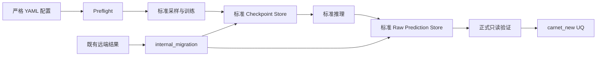

# UPET BootStrapping 代码整理与既有结果适配设计

## 文档状态

- 日期：2026-08-14
- 状态：设计内容已逐节确认，等待书面审阅
- 目标目录：`Uncertainty_Quantification/BootStrapping`
- 参考实现：`carnet_new/Uncertainty_Quantification/BootStrapping`
- 结构参考：`Uncertainty_Quantification/FGE`
- 实施门禁：本设计文档获得用户书面确认后，才能编写 implementation plan；在 implementation plan 获批前不得开始实现

## 1. 背景

旧 BootStrapping 实现及其既有结果位于旧 UPET 仓库的 `Ensemble` 目录。目标是在新 UPET 仓库中整理出一套可发布、可独立使用的 BootStrapping 实现，并让已经完成的训练结果适配该实现。

本任务不使用新代码重新训练三组全量结果，也不重新执行全量模型推理。既有 checkpoint 与 prediction 是本次需要保留的科学计算产物；旧 UQ、evaluation、plots、训练日志和 W&B 数据不迁移。标准化 prediction 完成后，UQ 使用 carnet_new 的统计定义重新计算。

本地与远端职责严格分离：

- 本地只进行代码、配置、测试代码和文档的开发。
- 所有代码执行、测试、小数据 CPU 验证、结果适配和全量 UQ 计算均在远端完成。
- 远端使用 `conda activate upet_new` 激活环境。
- 全量 checkpoint、prediction 和 UQ outputs 不复制到本地，也不进入 Git。

## 2. Precheck 已确认事实

### 2.1 旧代码与版本

旧实现来自：

- 分支：`ShallowEnsemble`
- commit：`df1dbf3acdc537b0481dcff82dc8bb5849c2179f`
- 主要目录：`Ensemble/src/BootStrapping`

旧实现的计算链路包括 preflight、bootstrap sampling、最后层训练、checkpoint、raw/EMA 状态、prediction、UQ、evaluation 和 plotting。

### 2.2 既有运行

远端存在三组完整运行：

1. `full_remote_b8_e8`，学习率 `3e-5`
2. `lr_1e-4`，学习率 `1e-4`
3. `lr_1e-6`，学习率 `1e-6`

每组运行有 8 个有效成员。所有成员均包含 `best.pt`、`final.pt` 和 `latest.pt`，checkpoint 内 raw/EMA 参数键匹配，tensor 全部 finite，最后层参数总数为 13,338。

远端结果总量约 8.5 GB，其中大部分来自 W&B 和训练日志；本次所需核心结果主要是 checkpoint 与约 600 MB prediction 数据。

### 2.3 Bootstrap 与训练语义

- 训练集包含 348,780 个结构和 2,753,112 个原子。
- 每个成员执行 N-out-of-N 有放回采样。
- 成员随机种子由 `SeedSequence([2026, member_index])` 派生。
- 三组运行的同编号成员使用相同 bootstrap 样本，这是有意设计。
- 只训练 `node_last_layers` 与 `edge_last_layers`。
- 优化器为 Adam，无 scheduler，weight decay 为 0，gradient clipping 为 1.0。
- EMA decay 为 0.999，只跟踪最后层。
- `best.pt` 由 raw validation loss 的严格最小值选择，并保存同一 epoch 的 raw/EMA 配对状态。

旧实现对重复 bootstrap occurrence 使用独立 occurrence ID，避免重复结构进入同一 batch 时发生 metatensor system-label 冲突。训练 loss 由基础 checkpoint 恢复，包含 energy、保守力、virial、非保守力和 stress 项。

### 2.4 Prediction 完整性

已有 prediction 只使用 `best.pt/raw`。虽然旧 YAML 曾声明 raw/EMA prediction 分支，但真实结果仅包含 raw，这与后续 raw-only 实施决定一致。

全量核对覆盖：

- 3 个运行
- val/test 两个 split
- 每个 split 8 个成员
- 每个成员 76 个 chunk
- 共 3,648 个 chunk

所有 chunk 均满足：

- 序号连续且无缺口；
- 结构区间连续；
- energy、forces、stress shape 正确；
- 所有值 finite；
- 结构和原子布局一致；
- 同一 split 的成员使用相同 reference。

数据规模为：

- val：19,370 个结构，152,959 个原子
- test：19,374 个结构，149,321 个原子

### 2.5 新旧数据关系

新仓库数据位于：

- `data/dataset/matpes_train.extxyz`
- `data/dataset/matpes_val.extxyz`
- `data/dataset/matpes_test.extxyz`
- `data/dataset/matpes_n20.extxyz`
- `data/checkpoint/pet-omatpes-l-v0.1.0.ckpt`

基础 checkpoint 与既有结果使用的 checkpoint SHA 完全相同。新旧数据具有相同的 split 数量、结构顺序、结构 ID、元素序列、原子数以及 energy/forces/stress targets；但 train/test positions 和高精度 cell 数值并非逐字节相同。

经用户确认，新实现不使用数据集 SHA 构造运行身份，也不把旧结果绑定到旧数据指纹。所有运行直接使用配置文件指定的数据集，同时进行结构 ID、顺序、原子数和 target shape 检查。

### 2.6 配置权威性

`full_remote_b8_e8` 的权威配置是远端实际运行配置，而不是旧仓库本地同名 YAML：

- training batch size：64
- prediction batch size：64
- 配置 SHA：`b6875f70cac379eafe3878c43fb94fa4427bfdbc98e55058903952121b8d9a31`

另外两组已验证配置保留原值：

- `lr_1e-4`：training/prediction batch size 为 16/8
- `lr_1e-6`：training/prediction batch size 为 16/8

这些数值仅是三份配置的默认值。代码接受任意合法的正整数 batch size，不把 64、16 或 8 写死在实现中。

### 2.7 已知旧实现缺口

旧代码存在以下不应直接复制的问题：

- `resume_decision()` 未真正接入训练主流程。
- running/invalid member 会重新开始，而不是可靠恢复 optimizer、epoch 和 RNG。
- valid member 跳过时没有重新审计 artifact 内容。
- 标记 valid 前没有执行完整 reload/finite-forward 验证。
- preflight 记录 selected base state，但运行时固定读取 restart state。
- 代码硬性要求 `metatrain==2026.1`，不能直接运行于当前 `upet_new` 环境。
- manifest 缺少足够的 artifact 完整性信息。
- 部分正式配置和结果 metadata 含旧绝对路径。

新实现需要保留已经验证正确的科学语义，同时修复上述工程缺口。

## 3. 已确认范围

### 3.1 迁移内容

三组运行全部适配。每个成员保留：

- `best.pt`
- `final.pt`
- `latest.pt`
- checkpoint 内已有 raw/EMA 状态
- val/test raw predictions

标准化过程中会生成解释这些产物所需的最小 metadata、manifest、shape、单位和 artifact 完整性校验值。

### 3.2 不迁移内容

- 旧 bootstrap indices 与 OOB indices
- 旧训练日志
- W&B 数据
- 旧 UQ
- 旧 evaluation
- 旧 plots
- 旧 failure artifacts

标准实现仍支持新训练保存 bootstrap indices、OOB、日志和完整训练状态，但既有结果适配不伪造不存在或不迁移的阶段产物。

### 3.3 本轮新增计算

本轮允许的新增科学计算只有：

- 远端 CPU 小数据测试所需的最小训练与推理；
- 对标准化后的全量 raw predictions 重新计算 UQ。

三组全量结果不重新训练、不重新推理。旧 evaluation 和 plots 不重新生成，也不作为本轮验收要求。

## 4. 方案选择

### 4.1 已选方案：一次性规范化适配器与独立标准实现

旧 checkpoint 原样复制并校验；旧 prediction chunks 通过流式处理写入新的标准 prediction store。适配完成后，正式训练、预测和 UQ 代码只认识新格式，不依赖旧仓库。

选择理由：

- 正式代码不长期背负旧路径和旧 schema。
- checkpoint 可保持字节级不变。
- prediction 数值保持不变，但存储接口统一。
- 适配可幂等执行、分运行恢复并全量验证。
- 最适合本地只保留可发布代码、远端保存 outputs 的约束。

### 4.2 未选方案

#### 直接读取旧目录

虽然无需转换，但会让正式代码永久依赖旧命名、旧 manifest、旧绝对路径和 raw-only 特例，因此拒绝。

#### 同时保留旧格式和新格式

会产生两个可能被视为权威的结果版本，增加存储和误用风险，因此拒绝。

## 5. 代码结构

代码结构以新仓库 FGE 的迁移组织为直接参考：正式代码、命令入口、正式测试和内部适配工具明确分层。

```text
Uncertainty_Quantification/BootStrapping/
├── __init__.py
├── bootstrap/
│   ├── __init__.py
│   ├── errors.py
│   ├── config.py
│   ├── data.py
│   ├── sampling.py
│   ├── head_policy.py
│   ├── training.py
│   ├── checkpoint.py
│   ├── members.py
│   ├── prediction.py
│   ├── uncertainty.py
│   ├── evaluation.py
│   ├── artifacts.py
│   ├── manifests.py
│   ├── preflight.py
│   └── validation.py
├── scripts/
│   ├── __init__.py
│   ├── _cli.py
│   ├── preflight.py
│   ├── train.py
│   ├── predict.py
│   ├── compute_uq.py
│   └── validate.py
├── internal_migration/
│   ├── README.md
│   ├── __init__.py
│   ├── migration/
│   │   ├── __init__.py
│   │   ├── legacy_reader.py
│   │   ├── normalization.py
│   │   └── converter.py
│   ├── scripts/
│   │   ├── __init__.py
│   │   ├── _cli.py
│   │   ├── inspect_results.py
│   │   ├── migrate_results.py
│   │   ├── validate_migration.py
│   │   └── audit_results.py
│   └── tests/
├── configs/
│   ├── upet_bootstrap_full_remote_b8_e8.yaml
│   ├── upet_bootstrap_lr_1e-4.yaml
│   └── upet_bootstrap_lr_1e-6.yaml
├── tests/
├── outputs/
│   └── .gitignore
└── README.md
```

### 5.1 依赖方向

- `bootstrap/` 是唯一正式业务实现。
- `scripts/` 只负责 CLI、配置加载、调用和退出码转换。
- `internal_migration/` 可以调用正式 artifact writer 与 validator。
- `bootstrap/`、正式 `scripts/` 和正式测试禁止导入 `internal_migration/`。
- `internal_migration/` 保留在开发仓库，但不进入公开 wheel、sdist 或发布代码包。
- `outputs/` 仅保留 `.gitignore`，其余内容全部忽略。

### 5.2 从 FGE 复用的模式

- `inspect -> migrate -> validate -> audit` 四阶段适配流程。
- 正式模块与内部适配模块单向依赖。
- 同文件系统 sibling staging。
- no-compute guard。
- path escape、symlink、hash drift、missing artifact 和 restart 边界测试。
- 原子发布与 no-clobber 行为。

### 5.3 不从 FGE 复制的约束

- 不硬编码数据集 SHA。
- 不硬编码固定 project 名或固定运行规模。
- 不迁移旧 UQ/evaluation。
- 不只支持 test split；BootStrapping 同时支持 val/test。
- 不把 outputs 中的临时脚本、缓存或调试文件当作正式结构。

## 6. 配置契约

配置采用严格 YAML schema，未知键、缺失键和类型错误均直接失败。相对路径以 YAML 文件所在目录为基准解析。

建议结构如下：

```yaml
schema_version: 1

experiment:
  name: upet-bootstrap-head-posttrain-v1
  run_id: full_remote_b8_e8
  output_root: ../outputs

checkpoint:
  base_path: ../../../data/checkpoint/pet-omatpes-l-v0.1.0.ckpt

data:
  train: ../../../data/dataset/matpes_train.extxyz
  val: ../../../data/dataset/matpes_val.extxyz
  test: ../../../data/dataset/matpes_test.extxyz
  units:
    energy: eV
    forces: eV/Angstrom
    stress: eV/Angstrom^3

bootstrap:
  ensemble_size: 8
  base_seed: 2026
  sample_size: null
  replacement: true
  save_indices: true
  save_oob: true

training:
  batch_size: 64
  max_epochs: 8
  trainable_head: pet_last_layers
  optimizer:
    name: Adam
    learning_rate: 3.0e-5
    weight_decay: 0.0
  scheduler: none
  gradient_clip: 1.0
  ema_decay: 0.999
  device: cuda
  precision: float32
  num_workers: 0

prediction:
  splits: [val, test]
  parameter_modes: [raw]
  batch_size: 64
  structure_chunk_size: 256
  device: cpu
  num_workers: 0

uncertainty:
  parameter_modes: [raw]
  ddof: 1
  compute_std: true
  compute_gmd: true
  gmd_pairs: distinct_unordered
```

配置规则：

- `ensemble_size >= 2`。
- batch size、chunk size、epoch 和 worker 数均进行范围验证。
- `sample_size: null` 表示使用训练集大小 N。
- 既有三组运行的 `prediction.parameter_modes` 固定为 `[raw]`，因为没有真实 EMA prediction。
- 标准代码允许新运行请求 raw、EMA 或两者，但同一次 UQ 聚合不得混合 parameter mode。
- 数据集完全由配置路径指定，不存在 `identity.train_data_sha256` 等运行绑定字段。
- artifact SHA 只用于检测结果文件损坏，不用于绑定数据集或构造 run ID。

## 7. 标准结果目录与 Schema

```text
outputs/
└── upet-bootstrap-head-posttrain-v1/
    └── full_remote_b8_e8/
        ├── resolved_config.yaml
        ├── run_manifest.json
        ├── members/
        │   ├── member_000/
        │   │   ├── manifest.json
        │   │   └── checkpoints/
        │   │       ├── best.pt
        │   │       ├── final.pt
        │   │       └── latest.pt
        │   └── member_007/
        ├── predictions/
        │   ├── val/
        │   │   ├── targets.npz
        │   │   ├── manifest.json
        │   │   └── members/
        │   │       ├── member_000/raw.npz
        │   │       └── member_007/raw.npz
        │   └── test/
        ├── uncertainty/
        │   ├── val/raw/
        │   │   ├── results.npz
        │   │   └── manifest.json
        │   └── test/raw/
        └── logs/
```

### 7.1 分阶段合法性

`run_manifest.json` 按阶段记录状态。sampling、training、prediction 和 UQ 可独立完成。因此，仅具有 checkpoint 与 prediction 的适配运行是合法的部分完成运行，不需要伪造 sampling、optimizer history、训练日志或 W&B。

### 7.2 Checkpoint manifest

每个 member manifest 至少记录：

- schema version；
- member index；
- `best/final/latest` 相对路径；
- 文件大小与 SHA256；
- epoch 与 validation loss（若源文件提供）；
- raw/EMA key 摘要；
- tensor dtype；
- trainable tensor 数和参数总数；
- `inference_ready`；
- `resume_ready`。

能力要求：

| 文件 | inference_ready | resume_ready |
|---|---:|---:|
| `best.pt` | 必须 | 不要求 |
| `final.pt` | 必须 | 不要求 |
| `latest.pt` | 必须 | 新生成结果必须 |

既有 checkpoint 不重新序列化，不合成 optimizer/RNG 等不存在的状态。如果既有 `latest.pt` 不满足恢复训练要求，则如实记录 `resume_ready=false`。

### 7.3 Prediction store

每个 split 只保存一份 `targets.npz`：

- `structure_ids`
- `num_atoms`
- `atom_offsets`
- reference energy
- reference forces
- reference stress

每个成员与 parameter mode 保存一个 prediction NPZ：

- `energy`：`[N_structures]`
- `forces`：`[sum(num_atoms), 3]`
- `stress`：`[N_structures, 3, 3]`

设计规则：

- targets 从配置指定数据集读取。
- prediction 保留源数值与 dtype，不做模型推理或数值变换。
- UQ 加载后在内存中转换为 float64 进行归约。
- 不在每个成员文件中重复 targets。
- manifest 记录数组名称、shape、dtype、单位、member、split、parameter mode、artifact 路径和 SHA。
- 不记录旧绝对路径，也不在正式 manifest 中加入 legacy/migration 来源字段。

## 8. 正式运行数据流



正常运行与既有结果适配最终汇入同一 checkpoint/prediction schema。适配路径不得调用训练、模型 forward 或正式推理。

### 8.1 Preflight

正式 preflight 负责：

- 加载并验证配置；
- 检查数据 split、目标字段、单位、结构 ID 和 atom layout；
- 检查基础 checkpoint 可以恢复模型和 loss contract；
- 检查仅指定最后层可训练，参数量为 13,338；
- 检查输出路径安全与目标状态；
- 记录 Python、Torch、metatrain、metatomic 和 upet 版本；
- 做 API/schema 能力检查，而不是固定要求 `metatrain==2026.1`。

### 8.2 Sampling 与训练

- 每个成员通过 `SeedSequence([base_seed, member_index])` 派生独立随机流。
- N-out-of-N 有放回采样。
- 重复样本使用 occurrence dataset 表达。
- 仅训练 PET 最后层。
- 沿用 checkpoint 恢复的正式多目标 loss。
- raw validation loss 严格下降时更新 best。
- 同一 best epoch 同时保存 raw/EMA。
- `latest.pt` 保存模型、EMA、optimizer、epoch 和 RNG，使新生成结果可真正 resume。

修复后的 resume 规则：

- valid 且审计完整的成员只读跳过；
- running 成员仅在 `latest.pt` 符合完整恢复契约时继续；
- 缺失恢复状态时明确失败；
- 不从头覆盖已有成员；
- 不把推理可用误报为恢复训练可用。

### 8.3 正式推理

正式推理：

1. 从配置选择 split、checkpoint kind 和 parameter mode。
2. 默认选择 `best.pt/raw`。
3. 按配置数据集顺序加载结构。
4. 分 chunk 计算 energy、forces 和完整 `3x3` stress。
5. 使用磁盘临时区累计，避免完整 ensemble 常驻内存。
6. 每个成员完成后发布标准 NPZ。
7. 所有成员完成后执行跨成员 layout 检查。

既有三组结果不执行本流程，只由内部适配器写入同一标准 store。

## 9. UQ 定义

旧 UQ 使用 population STD 和包含 self-pair 的 GMD；新结果不沿用该定义。

对 B 个成员的任意逐元素预测值：

\[
\bar{x}=\frac{1}{B}\sum_{i=1}^{B}x_i
\]

\[
s=\sqrt{\frac{\sum_{i=1}^{B}(x_i-\bar{x})^2}{B-1}}
\]

\[
\mathrm{GMD}=\frac{2}{B(B-1)}\sum_{i<j}|x_i-x_j|
\]

即：

- STD 使用 `ddof=1`。
- GMD 只统计不同成员的无序 pair。
- raw 和 EMA 不混合。
- 归约使用 float64。
- STD 一次只读取一个成员。
- GMD 一次最多读取两个成员。
- 不构建完整 `[B, ...]` ensemble tensor。

正式 UQ 结果至少包括：

- ensemble mean；
- energy STD/GMD；
- energy-per-atom STD/GMD；
- force component STD/GMD；
- 每原子的 force vector RMS；
- stress component STD/GMD；
- 每结构的 stress tensor RMS；
- member count、parameter mode、split、单位和公式版本。

当 B=8 时，新旧逐元素结果应有以下理论关系，可作为附加 sanity check：

- `new_std ~= old_std * sqrt(8/7)`
- `new_gmd ~= old_gmd * 8/7`

旧 UQ 不作为新 UQ 输入；正式真值始终直接由标准化后的成员 predictions 计算。

## 10. 内部结果适配流程

### 10.1 `inspect_results`

- 只读解析三个指定运行。
- 检查运行名、8 个成员、三类 checkpoint 和 val/test prediction。
- 验证 chunk 数量、序号、范围、shape、dtype、finite 与 reference layout。
- 输出适配计划，不写正式目标。

### 10.2 `migrate_results`

- 使用目标目录的 sibling staging。
- checkpoint 字节级复制。
- prediction chunks 按结构顺序流式合并。
- targets 从配置指定数据集生成。
- 使用正式 artifact writer 写标准 schema。
- 不调用 training、forward、backward、optimizer、prediction、UQ 或 evaluation。

### 10.3 `validate_migration`

- 调用正式 `bootstrap.validation`。
- 审计 checkpoint、prediction、manifest 和目录边界。
- 将每个旧 chunk 与新 NPZ 对应切片比较。
- prediction 数值、dtype 和 shape 要求精确相等。

### 10.4 `audit_results`

- 对已经原子发布的结果执行只读复核。
- 验证外部 audit 与全部 artifact SHA。
- 验证源关键文件在适配前后未变化。
- 不修改标准 outputs。

三组运行独立 staging 与发布，一个运行失败不能污染另外两个。

## 11. 原子性与错误处理

### 11.1 统一失败模型

采用与 FGE 一致的 `HardFailure` 风格：

- 配置、路径、artifact、schema、数值和状态错误使用明确领域异常。
- CLI 对预期错误输出简洁 stderr 并返回退出码 2。
- 非预期错误保留 traceback。
- 不用 warning 代替失败。
- 不静默跳过损坏成员或缺失 chunk。

错误信息必须包含可定位上下文，例如 run、split、member、artifact 和原因。

### 11.2 路径安全

- 源与目标解析后不能相同或互相包含。
- 所有正式 artifact 必须位于 result root 内。
- 拒绝 symlink、`..` 和路径替换逃逸。
- 旧结果目录始终只读。
- 已存在且内容不同的目标禁止覆盖。
- 不提供隐式 `--force`。
- staging 与最终目标必须位于同一文件系统。

### 11.3 发布顺序

1. 创建 sibling staging。
2. 写 resolved config。
3. 复制并验证 checkpoint。
4. 转换并验证 prediction。
5. 构建 manifests。
6. 调用正式 validator。
7. 重新核对源 artifact。
8. 写外部 audit。
9. fsync 文件与目录。
10. 将 staging 原子重命名为最终目录。

任何步骤失败时最终目标不得出现。失败 staging 保留并报告路径，不自动删除，由用户显式清理。

### 11.4 幂等性

- 目标存在且内容一致：验证后报告已完成，不重写。
- manifest 缺失但 artifact 完整：仅允许在 staging 内重新审计并生成 manifest。
- 目标存在且内容不同：硬失败。
- 不在正式目标上进行部分修补或就地覆盖。

## 12. 远端测试策略

所有测试均在远端 `upet_new` 环境运行。本地不执行测试、训练、推理、适配或 UQ。

### 12.1 静态与单元测试

- Ruff format check
- Ruff lint
- mypy
- 配置严格性
- sampling determinism
- occurrence dataset
- checkpoint 能力审计
- prediction store round trip
- sample STD
- distinct-pair GMD
- manifest 与路径安全
- CLI 退出码
- 正式模块与 internal migration 的 import 边界

测试继续使用 warnings-as-errors。已知第三方兼容 warning 只能加入精确 allowlist，不允许在实现中宽泛屏蔽。

### 12.2 故障注入

- 写入中断
- fsync/rename 失败
- source hash drift
- missing chunk
- chunk 重复或错序
- member reorder
- shape/dtype/reference disagreement
- symlink/path escape
- 目标已存在
- latest checkpoint 缺 optimizer/RNG
- failed staging 重启

### 12.3 No-compute guard

内部适配测试 monkeypatch 以下操作为硬失败：

- `torch.nn.Module.forward`
- `Tensor.backward`
- optimizer step
- 正式 training 入口
- 正式 prediction 入口
- 正式 UQ/evaluation 入口

适配器必须在这些 guard 下完成 checkpoint/prediction 转换。

### 12.4 远端 CPU 小数据原生流程

使用 `matpes_n20.extxyz` 或等价小数据配置：

- ensemble size 为 2；
- 训练 1 epoch；
- 设备为 CPU；
- 生成 `best/final/latest`；
- 使用 `best/raw` 生成 val/test prediction；
- 计算 sample STD 和 distinct-pair GMD；
- 正式 validator 返回 PASS。

### 12.5 远端 CPU 小数据适配流程

- 构建具有旧目录和 chunk 形式的小型 fixture。
- 运行 inspect、migrate、validate、audit。
- 不运行模型计算。
- 使用正式 loader 读取适配结果。

### 12.6 Schema 等价定义

原生小数据结果与适配小数据结果要求：

- 相同目录层级；
- 相同 manifest schema 和必需字段；
- 相同 NPZ array 名称、dtype 类别与维度契约；
- 相同 checkpoint capability 表达；
- 相同正式 loader 返回类型；
- 相同 validator 状态。

独立 NPZ 可能因 ZIP 容器元数据不同而具有不同 SHA，因此不要求两个独立生成的 NPZ 字节相同。对于同一旧 prediction 的迁移前后数值，则要求 `np.array_equal`。

## 13. 全量远端验收

### 13.1 目标数量

三组运行适配完成后应有：

- 3 个标准运行目录；
- 24 个成员目录；
- 72 个 checkpoint；
- 48 个 raw prediction NPZ；
- 6 个 targets NPZ；
- 6 组新 UQ 结果。

### 13.2 Checkpoint 验收

- 72 个目标 checkpoint 与源文件逐一 SHA 相同。
- 24 个成员均通过 CPU load、finite 和 raw/EMA schema 检查。
- 最后层参数量为 13,338。
- best epoch/loss 与旧成员摘要一致。
- 能力字段如实区分 inference 与 resume。

### 13.3 Prediction 验收

- 3,648 个旧 chunks 全部映射到 48 个标准 NPZ。
- 每个旧数组与目标对应切片 `np.array_equal`。
- val/test 结构数与原子数符合 Precheck。
- 每个 split 的 8 个成员 layout 完全一致。
- 所有数值 finite。

### 13.4 UQ 验收

正式 bounded-memory 实现与独立 NumPy 参考公式交叉验证：

- ensemble mean：`rtol=1e-13, atol=1e-15`
- STD/GMD：`rtol=1e-12, atol=1e-14`

旧 UQ 只允许作为只读附加关系检查，不能被复制或写入新 UQ store。

### 13.5 整体通过条件

- 三个 run 的正式 validator 均返回 PASS。
- 源目录关键 artifact 在适配前后 SHA 不变。
- 新标准结果中不存在旧 UQ、evaluation、plots、W&B 或训练日志。
- 三个运行可以分别重复 audit。
- outputs 不进入 Git。

## 14. 发布边界

### 14.1 正式发布内容

- `bootstrap/`
- 正式 `scripts/`
- 正式配置模板
- 正式测试
- 面向用户的 README

### 14.2 不发布内容

- `internal_migration/`
- `outputs/`
- checkpoint/prediction/UQ 大文件
- 外部适配 audit
- W&B、logs、plots
- `__pycache__`
- 远端 staging 与失败工件

发布构建必须自动检查 wheel、sdist 或其他发布代码包中不存在上述内容。公开 README 不要求旧仓库存在，正式包在没有旧结果目录的环境中必须可以 import 和运行正常配置检查。

开发仓库保留 `internal_migration/`，以便审计和重复执行；它不是正式公共 API，也不能通过正式包入口访问。

## 15. 明确不在本设计内的工作

- 重新训练三组全量 bootstrap ensemble。
- 对三组全量 checkpoint 重新推理。
- 迁移或复现旧 population-STD/self-pair-GMD UQ。
- 迁移旧 evaluation、risk curves 或 plots。
- 修改 FGE、ConfidenceHead、LLPR 或其他 UQ 方法。
- 将远端全量数据复制到本地。
- 将 batch size、运行名或数据路径硬编码进正式实现。

## 16. 完成定义

本任务只有同时满足以下条件才算完成：

1. 正式 BootStrapping 代码通过远端静态检查、单元测试和 CPU 小数据原生流程。
2. internal migration 通过 no-compute、故障注入和 CPU 小数据适配测试。
3. 原生与适配小数据产物通过 schema 等价验证。
4. 三组远端结果的 checkpoint 与 raw predictions 完成标准化并通过全量审计。
5. 六组 UQ 使用 carnet_new 定义从标准 raw predictions 重新计算并通过独立公式验证。
6. 旧源结果保持只读且关键 SHA 不变。
7. 本地 Git 不包含 outputs 或远端大文件。
8. 发布构建不包含 `internal_migration/` 和其他内部/生成内容。
